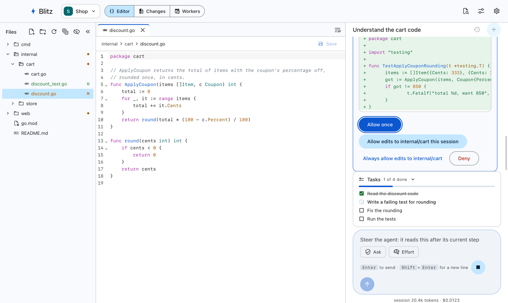

# Blitz ⚡

> **The zero-gimmick, high-performance Go coding agent.**

Blitz reads your workspace, makes the change, checks it, and gets out of the way: no persona, no filler, no chatter. It's written in Go on Google's Agent Development Kit and runs Gemini, Claude, OpenAI-compatible or Ollama models.



**Documentation: https://retail-cortex.github.io/blitz/**

## Why Blitz

- **Compiled Go.** The CLI starts in about 20 ms and idles in about 40 MB; one static binary, no runtime to install.
- **Safe by default.** Commands run in an OS sandbox (Seatbelt on macOS, bubblewrap on Linux), edits need your approval unless you've allowed them, and every turn can be undone.
- **Three ways in, one engine.** `blitz` in the terminal, the per-user service `blitzd` (which also runs scheduled workers), and a desktop app laid out like an IDE. A session started in one continues in the others.
- **Works with what you have.** `AGENTS.md`, `CLAUDE.md` and `GEMINI.md` load as project instructions; MCP servers, hooks, custom commands and Agent Skills all work.
- **Scriptable.** JSON and streaming JSON output, limits on turns, cost and time, and distinct exit codes.

## Install

Download the archive for your platform from the [releases](https://github.com/retail-cortex/blitz/releases): macOS (`darwin_arm64`, `darwin_amd64`), Linux (`linux_amd64`, `linux_arm64`) or Windows (`windows_amd64`). Each holds `blitz`, `blitzd`, the `blz` shortcut and the license files; put its folder on your `PATH`. The desktop app is `Blitz_<version>_macos_universal.dmg`, or `blitz-desktop_<version>_<arch>.deb` for Ubuntu 24.04, Debian 13 and later.

Verify a download against this repository's release workflow:

```bash
cosign verify-blob --bundle checksums.txt.sigstore.json \
  --certificate-identity-regexp '^https://github.com/retail-cortex/blitz/\.github/workflows/release\.yml@refs/tags/v' \
  --certificate-oidc-issuer https://token.actions.githubusercontent.com checksums.txt
sha256sum --ignore-missing -c checksums.txt
```

The macOS command-line binaries aren't notarized: clear the quarantine flag with `xattr -d com.apple.quarantine blitz blitzd`.

### Chromebooks (ChromeOS's Linux development environment)

The Linux `.deb` runs in ChromeOS's Linux container (Crostini): `amd64` on Intel Chromebooks such as the Pixelbook, `arm64` on ARM ones. It hasn't been tested there yet; reports are welcome.

- **Debian version.** The container is Debian 12 or 13 (`cat /etc/debian_version`). The app needs WebKitGTK 4.1 at 2.40 or later, which current Debian 12 has; the package refuses an older one. A Chromebook past its last ChromeOS update keeps its container's Debian updates, but may never move to a newer Debian.
- **Install.** `sudo apt install ./blitz-desktop_<version>_amd64.deb bubblewrap`. bubblewrap is the shell sandbox; gVisor is unlikely to run in the container, and in `auto` mode Blitz uses bubblewrap instead (`blitz doctor` says which).
- **A blank or garbled window.** Some Chromebooks can't pass WebKitGTK's rendering through the VM: start the app with `WEBKIT_DISABLE_DMABUF_RENDERER=1 blitz-desktop`.
- **Projects.** Linux sees its home directory and the folders shared with it in the Files app (under `/mnt/chromeos/`); open workspaces from there.
- **Keys.** The container has no keyring, so API keys are kept in `~/.blitz/secrets.toml`, readable only by you.
- **The service** runs as a `systemctl --user` service in the container. ChromeOS stops the container when you shut down or leave Linux idle, so scheduled workers only run while it's up.

## Quick start

```bash
blitz config init               # a commented ~/.blitz/.env.toml
blitz config set-key gemini     # your API key, into the OS keychain (or anthropic, openai)
blitz doctor                    # checks the settings, the key and the sandbox

cd ~/src/project
blitz                           # an interactive session
blitz "why does the build fail?"   # one prompt, then exit
```

In a session, ask for what you want. Blitz shows a diff before each edit and asks before commands run: `y` once, `s` for the session, `a` always, `n` no. `/undo` reverts the last turn and `/help` lists the commands. To use the desktop app and scheduled workers, start the service at login with `blitz service install`.

[Getting started](https://retail-cortex.github.io/blitz/getting-started/) goes further, and the [guide](https://retail-cortex.github.io/blitz/guide/) covers configuration, safety, models, extending and more.

## Building from source

Blitz builds with [Bazel](https://bazel.build) 9.2, which downloads Go, Node, pnpm, buf, Hugo and every dependency at pinned versions. Install [Bazelisk](https://github.com/bazelbuild/bazelisk) as `bazel` (it picks the version in `.bazelversion`); nothing else of that toolchain needs installing.

### macOS (13 or later, Apple silicon or Intel)

```bash
xcode-select --install                   # or install Xcode, and: sudo xcode-select -s /Applications/Xcode.app
brew install bazelisk
git clone https://github.com/retail-cortex/blitz.git && cd blitz
```

The builds and tests are run with the full Xcode installed.

### Linux (Ubuntu 24.04 or Debian 13 and later)

```bash
sudo apt-get install -y git bubblewrap pkg-config libgtk-3-dev libwebkit2gtk-4.1-dev
sudo curl -fsSLo /usr/local/bin/bazel https://github.com/bazelbuild/bazelisk/releases/latest/download/bazelisk-linux-amd64
sudo chmod +x /usr/local/bin/bazel       # bazelisk-linux-arm64 on ARM
git clone https://github.com/retail-cortex/blitz.git && cd blitz
```

GTK and WebKitGTK are only for the desktop app; bubblewrap is the shell sandbox.

### Windows

Building on Windows isn't supported: use WSL 2 and the Linux steps. The Windows archive cross-compiles on macOS or Linux (`bazel build //release:archives`).

### Build, test and run

```bash
bazel build //:build-all                  # everything for this machine: //:build-all-linux or //:build-all-mac
bazel test //...                          # every test: Go, the desktop page, the protos

bazel run //:blitz -- doctor              # the CLI (arguments after --); built at bazel-bin/apps/cli/blitz
bazel run //:blitzd                       # the service, in the foreground
bazel run //:desktop                      # the desktop app, with its own blitzd
bazel run //:desktop-web                  # the desktop page in a browser, http://localhost:5173/?fake
bazel run //:docs                         # the docs site, http://localhost:1313

bazel build //:mac-app                    # macOS: Blitz.app (universal)
bazel build //:deb                        # Linux: bazel-bin/apps/desktop/packaging/blitz-desktop_amd64.deb
sudo dpkg -i bazel-bin/apps/desktop/packaging/blitz-desktop_amd64.deb   # reinstalls even at the same version
bazel build --config=release //:archives  # the release archives, every platform, version from git
```

The short names are aliases in the root `BUILD.bazel`, which lists them; the full labels still work.

### Common problems

- **"bazel: command not found" or the wrong Bazel version.** Install Bazelisk as `bazel`; don't install Bazel itself.
- **The desktop app fails to build on Linux with a missing `gtk+-3.0` or `webkit2gtk-4.1`.** Install `libgtk-3-dev libwebkit2gtk-4.1-dev pkg-config`. Older distributions only ship WebKitGTK 4.0, which isn't supported.
- **`doctor` says the sandbox is unavailable on Ubuntu 24.04.** AppArmor restricts unprivileged user namespaces, which bubblewrap needs: `sudo sysctl -w kernel.apparmor_restrict_unprivileged_userns=0` (or an AppArmor profile for `bwrap`). Inside Docker, the default seccomp profile blocks them too.
- **The sandbox or gVisor tests skip.** They need bubblewrap (Linux) and `runsc` (`RUNSC_PATH`); CI fails if they skip, locally they don't.
- **Out of disk space.** A full build with tests and every platform's archive takes several gigabytes under Bazel's output base; `bazel clean` frees the build outputs.
- **`go build` fails.** Use Bazel: the API's generated Go code exists only in the build.

More in [building from source](https://retail-cortex.github.io/blitz/development/building/).

## Contributing

See [CONTRIBUTING.md](docs/CONTRIBUTING.md) and the [development guide](https://retail-cortex.github.io/blitz/development/). Maintainers are listed in [OWNERS.txt](OWNERS.txt).

## License

Apache License 2.0: see [LICENSE](LICENSE), [NOTICE](NOTICE), and [THIRD_PARTY_NOTICES](THIRD_PARTY_NOTICES) for the software Blitz includes. Every program shows them: `blitz license` (and `/license`), `blitzd --license`, and the desktop app's **Settings › About**.

Blitz began as a Go port of [Code Puppy](https://github.com/mpfaffenberger/code_puppy) by Mike Pfaffenberger (MIT).
