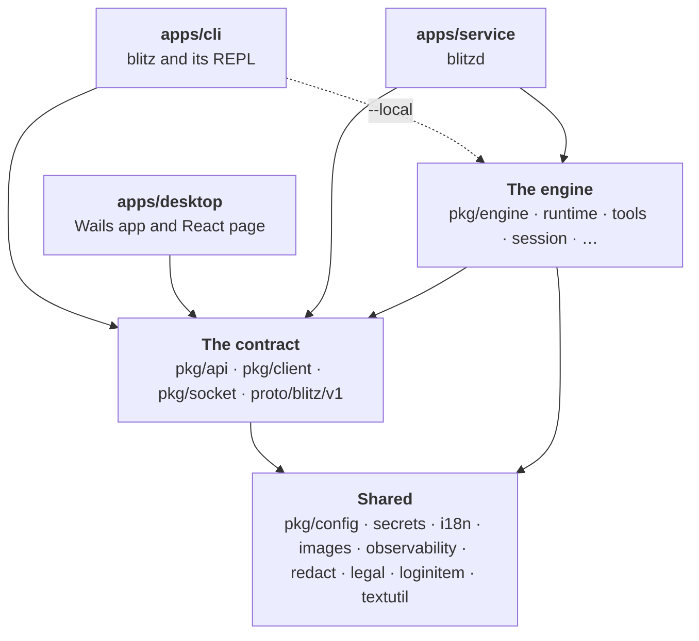

Blitz is a monorepo of three programs over shared Go packages, in one Go module (`github.com/retail-cortex/blitz`) built with Bazel. Spec: [monorepo](../about/specs/spec_monorepo_028.md).

## Layers

- **Apps** (`apps/`) are the programs. Code private to one app lives under `apps/<app>/internal/`.
- **The contract** is what front ends program against: `pkg/api` defines `Backend`, the interface a front end drives, with the values, events and typed errors that cross it. `proto/blitz/v1` is the same contract on the wire.
- **The engine** (`pkg/engine` and below) is Blitz without a user interface. `engine.Open` builds a `Workspace` that implements `api.Backend` in process. None of it prints.
- **Shared packages** (`pkg/`) are used by every layer: settings, catalogs, images, logs and telemetry. See [shared packages](../packages/_index.md).

## The dependency rules

- Apps depend on `pkg/`, never on each other. (Tests may run the service through `apps/service/servicetest`.)
- Front ends (the REPL, the desktop app), `pkg/api`, `pkg/client` and `pkg/socket` never reach the engine. Only the service and the CLI's `--local` mode link it.

The rules are enforced twice: the engine's Bazel `visibility` lists only who may use it, and `bazel run //tools:check_deps` (in CI) queries the build graph and fails on any library that breaks them.

## One interface, two implementations

A front end holds an `api.Backend` and doesn't know which it has:

| Implementation | Where the engine runs | Used by |
|---|---|---|
| `*engine.Workspace` | In the same process | The service; the CLI with `--local` |
| `*client.Remote` | In the service, over the socket | The CLI when the service runs |

The desktop app is a third client: its page calls the service's Connect API directly, through the app's socket proxy, with a generated TypeScript client.

This is why the CLI behaves the same attached or local, and why a session started in the terminal can continue in the desktop app.

## Where to read next

- [The engine](engine.md): a workspace, a turn, and the ADK.
- [The service API](service-api.md): the protos, streaming turns, approvals across processes.
- [Sandboxing and trust](security.md): the layers between the model and your machine.
- [The build](build.md): Bazel, generated code, static analysis, reproducible releases.
