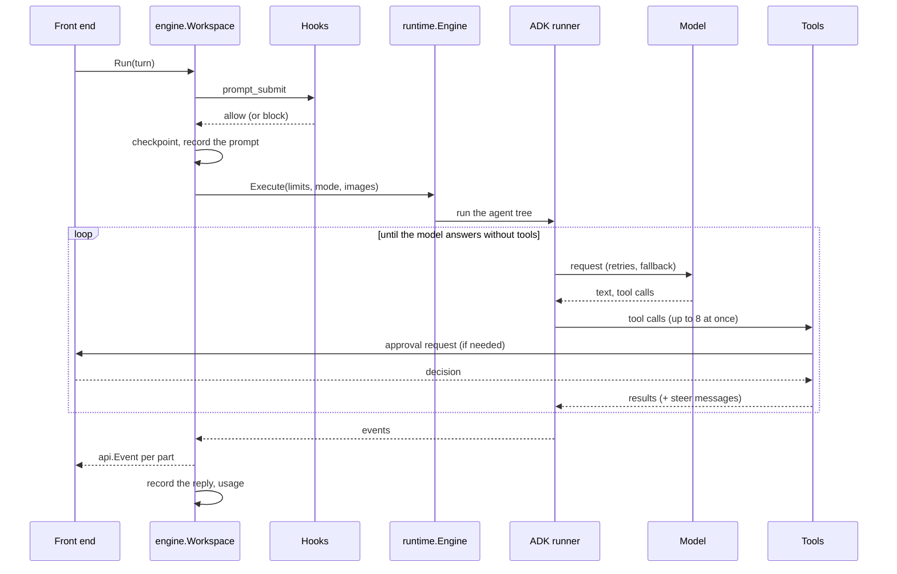

Specs: [workspace](../about/specs/spec_workspace_018.md), [engine](../about/specs/spec_engine_016.md), [sessions](../about/specs/spec_sessions_017.md).

## A workspace

`engine.Open(ctx, cfg, Options)` opens one project directory and returns a `*Workspace`. It builds, in order: the locale, the agent registry, skills, the tool registry, the image store, the audit log, session storage scoped to the workspace, the ADK's event store, the model, project memory, per-agent models, and the engine.

- **One owner.** An exclusive OS file lock (`flock`) on `~/.blitz/locks/<hash>.lock` means one process holds a workspace at a time. A second gets `ErrWorkspaceBusy`. The OS releases the lock if the process dies.
- **Its own settings.** A workspace owns and changes its copy of the configuration (model, pins, settings), so one process can hold many workspaces with different settings.
- **Never fails on a bad model.** If the configured model can't be built (no key, for example), the workspace opens on a placeholder model and `ModelErr()` says why, so a front end can show the problem and let you fix it.
- **Typed, not printed.** Operations return data and typed errors (`ErrNoActiveSession`, `*BlockedError`, …) that front ends word and translate themselves.

## A turn

`Workspace.Run(ctx, sessionID, api.Turn, handler)` runs one prompt:

- **Hooks first.** Unless the prompt was already accepted, `prompt_submit` hooks see it; a refusal returns `*BlockedError` and nothing is recorded or sent.
- **A checkpoint per prompt.** File tools copy a file before changing it, grouped under the prompt, which is what `/undo` and `/rewind` restore.
- **Limits.** `MaxTurns` caps model calls; `MaxCostUSD` is checked after every event; `Timeout` bounds the wall-clock time. Each stops the turn with its own error, which the CLI turns into exit code 3.
- **Events.** Each ADK event becomes one `api.Event` per part: text (partial or final, thought or not), a tool call, or a tool result. With streaming on, partial text arrives first and the final text repeats it marked `Repeat`, so front ends show text once.
- **Steering.** A message sent while the turn runs is recorded and queued; it reaches the model with the next tool result, so nothing is interrupted. Messages left unread when the turn ends come back as `Leftover`, for the front end to send as the next prompt.
- **Side questions.** `/btw` runs as an aside: a throwaway copy of the session, read-only, with no checkpoint, no transcript, and the steer queue untouched.

## The runtime

`pkg/engine/runtime` wraps Google's ADK runner (`google.golang.org/adk/v2`):

- **The agent tree**: the primary agent with the others as sub-agents reached through `invoke_agent`, at most three levels deep. Each agent's instructions include the project memory and the reply language.
- **Models**: Gemini, Anthropic, OpenAI-compatible and Ollama behind the ADK's model interface, each wrapped with retries, stall detection, the fallback chain (with a circuit breaker per model) and per-model settings.
- **Plan and read-only modes**: tools that change anything are refused while planning, including in sub-agents.
- **Compaction**: once a prompt passes the token threshold, history before the latest turn is summarized; the full transcript is kept for session search.
- **Usage and cost**: tokens (including cache reads and writes) priced by the model that actually answered.
- **Tracing**: a `turn` span per prompt, linked to the previous turn's, with the ADK's spans inside and their content removed.

## Sessions

`pkg/engine/session` stores each session twice over: a transcript (your prompts and the replies, what `/session` and search read) and the ADK's event log (what the model sees, compacted). Snapshots are named copies to branch from; loading one starts a new session and leaves the snapshot as it was. Sessions are scoped to their workspace.
