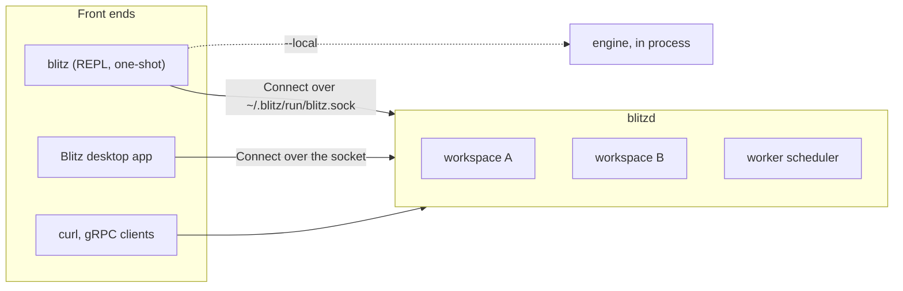

Blitz ships as three programs over one engine.

| Program | What it is | Runs the engine |
|---|---|---|
| [`blitz`](cli.md) | The CLI: an interactive session (the REPL) or a one-shot run | Attached to the service when it runs; in its own process with `--local` or when no service answers |
| [`blitzd`](service.md) | The per-user service: every workspace a client opens, the workers' schedules | Yes, for every client |
| [Blitz](desktop.md) | The desktop app: files, editor and chat, like an IDE | Through the service |

A workspace (a folder opened in Blitz) has one owner at a time: the service, or one CLI running `--local`. When the service holds it, the terminal and the desktop app share its sessions, approvals and settings, and a session started in one can be continued in the other.

The CLI and the service ship together in each [release archive](../getting-started/_index.md#install); the desktop app is its own package, and carries its own copies of both.
